## Differential group RTM effects in retinal age models

> *Full version coming soon.*

### 1. Study design

A deep retinal age model trained on color fundus photography (CFP) outputs an estimated retinal age $\hat a$. The retinal age gap, $\mathrm{RAG} = \hat a - a$, is interpreted as accelerated (RAG > 0) or decelerated (RAG < 0) biological aging relative to chronological age $a$ (**Fig. 1a**). Because the regressor is trained to minimise prediction error against $a$, predictions revert toward the training-set mean. This is known as the regression-to-the-mean (RTM) effect. We hypothesised that RTM is itself disease-modulated. In unhealthy eyes, the model loses age-specific cues and reverts more strongly than in healthy eyes, producing a *differential* RTM that has been mistaken in previous works for a true biomarker of biological aging (**Fig. 1b**).

To dissect this confound, we assembled one internal cohort (AlzEye, Moorfields) and three independent external cohorts spanning two continents and four imaging devices. After image-quality filtering and removal of records without confirmed disease labels, the analytic AlzEye cohort comprised 60,865 patients / 327,764 images, with mean ± s.d. age 63.07 ± 11.76 years (**Fig. 1c**, **Supplementary Fig. 1**). The internal cohort was partitioned at the patient level into two subsets that share no patients. The *retinal-age estimation subset* (12,306 patients / 67,718 images, healthy only) was used exclusively to train the regression model. The *disease-classification subset* (48,559 patients / 260,046 images, healthy + unhealthy) was used to fit and evaluate downstream logistic associations. External cohorts were UK Biobank (UKB; 29,835 patients / 51,709 images, Topcon), BRSET (5,529 patients / 10,287 images, Canon + Nikon) and mBRSET (1,277 patients / 5,107 images, Phelcom handheld). Per-split patient counts, image counts and age distributions are shown in **Supplementary Figs. 1–7**.

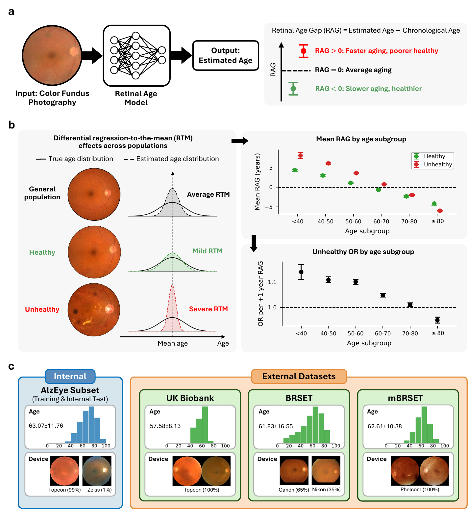

**Fig. 1. Overview of the study, mechanism, and study cohorts.**
**a.** Retinal age estimation and the retinal age gap (RAG). A deep retinal age model takes a colour fundus photograph (CFP) as the input and outputs an estimated retinal age. The RAG is defined as estimated age minus chronological age: a positive RAG (red) implies faster aging and poorer health, a negative RAG (green) implies slower aging and healthier status, and RAG = 0 (black) reflects average aging at the training-set scale.
**b.** Mechanism of differential regression-to-the-mean (RTM). Top-left: the true age distribution of the general population (solid) and the predicted-age distribution implied by the model (dashed); predictions contract toward the training mean. Middle-left: in healthy individuals, image features encode age well, so RTM is mild. Bottom-left: in unhealthy individuals, disease-related features dilute the age-specific signal and predictions revert more strongly to the mean (severe RTM). Right column: the empirical mean RAG by 10-year age subgroup confirms the prediction. RAG declines with chronological age in both groups but more steeply in unhealthy, and the implied per-year odds ratio for unhealthy status falls from > 1.10 in the youngest stratum to < 1.00 in the oldest.
**c.** Datasets used in this study. The internal AlzEye subset (blue) provided training and an internal hold-out test, and three external cohorts (UK Biobank, BRSET, mBRSET) were used for external generalisation testing. For each cohort the panel summarises the chronological-age distribution and imaging-device composition. All counts shown are after image-quality and disease-label filtering; full per-split breakdowns are in **Supplementary Figs. 1–7**.

### 2. Retinal age and RAG in the internal cohort

We trained the retinal age model on the retinal-age estimation subset (53,680 training images, **Fig. 2a**). On the held-out validation split, the model achieved a mean absolute error (MAE) of 5.31 years, RMSE of 6.80 years, and a mean RAG of −0.86 years (**Fig. 2b**). This is comparable to or better than published retinal-age benchmarks, despite the relatively narrow training-age window.

Applying the frozen model to the disease-classification subset, the marginal age-adjusted mean RAG at age 65 was significantly higher in every disease category than in healthy controls (mean RAG: healthy −0.7 yr, all-unhealthy +0.7 yr, cardiovascular +1.25 yr, chronic +0.65 yr, ocular +1.6 yr; all *P* < 0.001 vs. healthy; **Fig. 2c**). A logistic regression with disease as the outcome and RAG as the only predictor returned an odds ratio per +1 year RAG of 1.049 (95 % CI 1.046–1.053) for any unhealthy status, 1.041 (1.036–1.046) for cardiovascular disease, 1.048 (1.045–1.052) for chronic disease, and 1.065 (1.061–1.069) for ocular disease (**Fig. 2d**). Taken at face value, these effect sizes appear consistent with a generic biomarker of biological aging. However, as we now show, they are inflated by differential RTM rather than reflecting a single underlying aging signal.

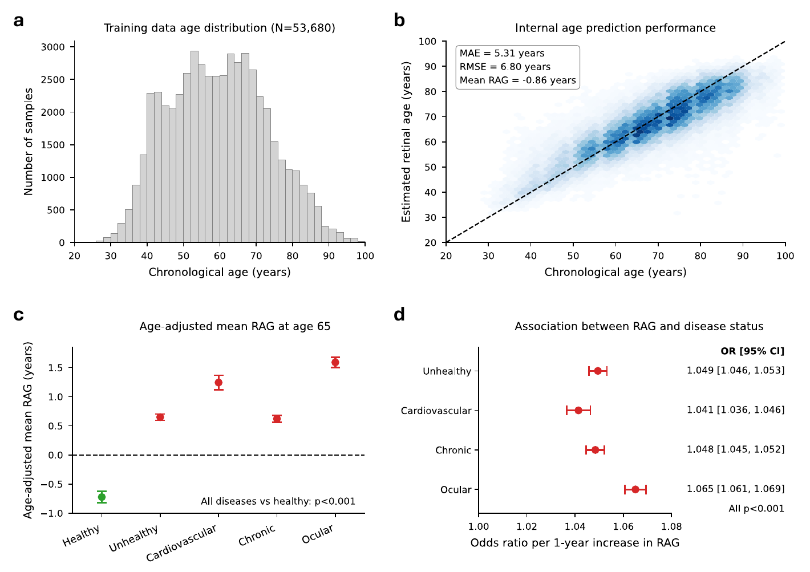

**Fig. 2. Internal retinal age prediction and association with disease on the AlzEye disease-classification subset.**
**a.** Training-set age distribution. Chronological age distribution of the training split of the retinal-age estimation subset, used to fit the retinal age model (1-year bins). Following previous works, the retinal age model is trained exclusively on healthy patients to better separate healthy and unhealthy groups at test time.
**b.** Internal retinal age model performance. Hexbin density of estimated retinal age vs chronological age on the held-out validation split of the retinal-age estimation subset; the dashed line is identity. The panel reports three commonly used metrics: Mean Retinal Age Gap (RAG), Mean Absolute Error (MAE) and Root Mean Square Error (RMSE). Lower MAE / RMSE indicates that estimated ages are closer to chronological ages.
**c.** Age-adjusted mean RAG by group. Marginal mean RAG predicted at age 65 for healthy patients and four disease categories (unhealthy = any non-healthy disease record; cardiovascular, chronic and ocular = subcategories). Error bars: 95 % confidence intervals (CIs) from a patient-level cluster bootstrap. P-values for the difference in mean RAG between each disease group and the healthy reference are reported in the panel.
**d.** Association analysis. Logistic regression was performed with each disease label as the outcome and RAG as the only predictor; reported are Odds Ratios (OR) per +1 year increase in RAG and 95 % CIs, with p-values from the Wald test. An OR > 1 indicates a positive association between higher RAG and disease prevalence.

### 3. Differential RTM by health status

Stratifying RAG by chronological age within disease group revealed a strong, *non-zero* slope of RAG against age in every group (**Fig. 3a,b**). The healthy slope was −0.184 (95 % CI −0.191 to −0.177) and the unhealthy slope was −0.314 (−0.318 to −0.310), with $P_{\text{interaction}} < 0.001$. Disease-specific slopes were steeper still: cardiovascular −0.345 (−0.353 to −0.336), chronic −0.320 (−0.324 to −0.316), and ocular −0.345 (−0.352 to −0.339; **Fig. 3c**). A non-zero RAG–age slope is the diagnostic signature of RTM. A true biomarker of biological aging should be approximately constant across chronological age. In contrast, a regression artefact that contracts predictions toward the training mean produces exactly this monotonically decreasing pattern.

We next asked whether the differential slope between healthy and unhealthy groups could be eliminated by post-hoc calibration. Linear age-calibration on healthy validation data flattened the healthy slope to 0.017 but only attenuated the unhealthy slope to −0.113 ($P_{\text{interaction}} < 0.001$; **Fig. 3d**); a quadratic calibration yielded essentially the same residual interaction (healthy 0.018, unhealthy −0.101, $P_{\text{interaction}} < 0.001$; **Fig. 3e**). Re-training the retinal age model on a uniform-age training distribution obtained by inverse-frequency resampling (**Fig. 3f**) likewise failed to remove the interaction (healthy −0.190, unhealthy −0.344, $P_{\text{interaction}} < 0.001$; **Fig. 3g**). The differential slope persists under three orthogonal interventions (linear calibration, quadratic calibration, and balanced training). This establishes that the RAG–age dependence is not a fixable training artefact. It carries a real, disease-modulated signal that cannot be linearly absorbed into an age coefficient.

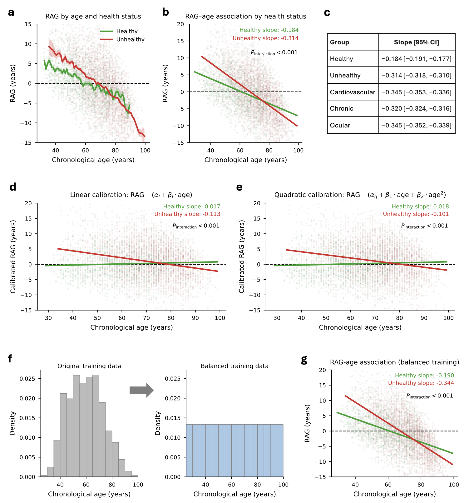

**Fig. 3. Differential RTM by health status persists under linear, quadratic and training-distribution calibration.**
All analyses are on the test split of the AlzEye disease-classification subset.
**a.** Mean RAG vs chronological age stratified by health status (1-year bins). Shaded bands are 95 % CIs from a patient-level cluster bootstrap. A non-zero RAG–age slope is the diagnostic signature of RTM.
**b.** Group-wise linear regression of RAG on chronological age. Slopes are reported with 95 % CIs and an interaction term tests whether the healthy and unhealthy slopes differ.
**c.** Slope estimates and 95 % CIs for healthy, unhealthy, and the three disease subcategories.
**d–e.** Re-evaluation after applying a linear (d) or quadratic (e) age-calibration fitted on the healthy validation split. Calibration is intentionally derived from healthy data only; the test of differential RTM is whether the unhealthy slope flattens to zero accordingly.
**f.** Training-distribution rebalancing. Original training-age distribution (left) and the uniform-age distribution obtained by inverse-frequency resampling (right) used for the balanced-training experiment.
**g.** RAG–age relationship after re-training the retinal age model on the balanced training distribution. Persistence of a differential slope between healthy and unhealthy here indicates that the effect is not a simple training-distribution artefact.

### 4. Utility of RAG in disease classification

Because RAG carries information that is not separable from chronological age by a univariate linear correction, we modelled the joint dependence with a logistic regression that included an explicit age × RAG interaction: $\text{logit}(\text{Unhealthy}) \sim \text{Age} + \text{RAG} + \text{Age} \times \text{RAG}$. The interaction was highly significant in every disease category. The implied marginal odds ratio per +1 year RAG decreased monotonically with chronological age, from ≈ 1.12 at age 30 to ≈ 1.00 at age ≈ 90 and below 1.00 for the oldest patients (**Fig. 4a**). In other words, an additional year of RAG carries strong evidence of disease in young patients but essentially none in the very elderly. This is exactly the dependence predicted by the differential-RTM mechanism, in which old patients are already pulled toward the training mean.

The interaction term contributed measurable discrimination beyond a main-effects-only model. Across all four disease categories the Age + RAG + Age × RAG model outperformed both the Age-only and Age + RAG models: unhealthy AUC 0.731 → 0.735 → 0.740, cardiovascular 0.806 → 0.808 → 0.815, chronic 0.726 → 0.729 → 0.736, ocular 0.758 → 0.768 → 0.774 (**Fig. 4b**). The advantage was concentrated in the youngest age stratum (< 45 years), where the interaction was largest in absolute terms (e.g. ocular AUC 0.58 → 0.79 → 0.80; **Fig. 4c**). The decision-boundary geometry made this explicit. Under the Age-only model, the boundary is a vertical line in age. Under Age + RAG, it becomes a tilted line. Under Age + RAG + Age × RAG, it becomes a curve whose slope flattens with increasing age, capturing the diminishing diagnostic value of RAG in older patients (**Fig. 4d**).

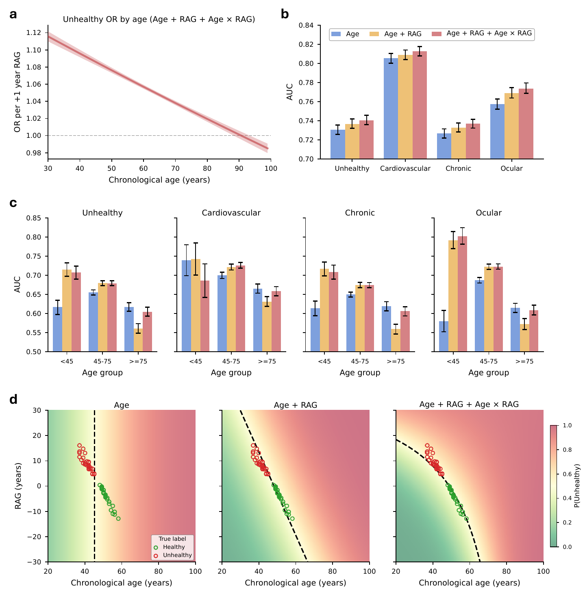

**Fig. 4. Utility of RAG in disease classification.**
All models are fitted and evaluated on the AlzEye disease-classification subset; AUCs are reported on the test split.
**a.** Marginal odds ratio per +1 year RAG by chronological age. Implied by the Age + RAG + Age × RAG logistic for the *Unhealthy* outcome. The interaction term allows the per-year RAG OR to vary continuously with age. Shaded band: 95 % CI from a patient-level cluster bootstrap. An OR > 1 indicates a positive RAG–disease association at that age.
**b.** Discrimination across logistic specifications. AUC for predicting unhealthy / cardiovascular / chronic / ocular disease under three nested models: Age only (blue), Age + RAG (yellow) and Age + RAG + Age × RAG (red). Error bars: 95 % CI.
**c.** Age-stratified discrimination. Same models as in b, stratified by chronological-age tertile (< 45, 45–75, ≥ 75).
**d.** Decision boundaries in the (Age, RAG) plane. The Age-only model (left) ignores RAG entirely; Age + RAG (centre) adds a fixed-slope age penalty; Age + RAG + Age × RAG (right) introduces a curved boundary that captures the age-dependent diagnostic value of RAG. Background colour: P(Unhealthy); points: held-out test cases.

### 5. Generalisation across external cohorts

We finally evaluated whether the AlzEye-trained retinal-age model, together with the AlzEye-fitted Age + RAG + Age × RAG logistic, transfers across populations and devices. Apparent age-prediction accuracy *appeared* to degrade only modestly across cohorts (UKB MAE 3.80 yr, BRSET 7.34 yr, mBRSET 8.40 yr; **Fig. 5a**). However, mean RAG was strongly cohort-dependent (UKB +1.48, BRSET −0.92, mBRSET −5.70 years). This reflects both device-specific bias and cohort-specific age distributions. Each external cohort was split 50/50 at the patient level, stratified by disease label.

For threshold-free discrimination of unhealthy vs healthy, the AlzEye-trained Age + RAG + Age × RAG logistic achieved an internal AUC of 0.741 (95 % CI 0.722–0.764). When applied off-the-shelf (i.e. without refitting either the logistic coefficients or the decision threshold), discrimination dropped substantially in every external cohort (UKB AUC 0.685 [0.677–0.692], BRSET 0.664 [0.652–0.677], mBRSET 0.614 [0.585–0.642]; **Fig. 5b**, light bars). Re-fitting the logistic *coefficients* on each external training split (externally calibrated) only marginally increased AUC (UKB 0.687, BRSET 0.671, mBRSET 0.638). This confirms that most of the AUC drop reflects cohort-level shifts in the underlying retinal-age representation, rather than miscalibration of the logistic.

Threshold-based metrics, evaluated at the AlzEye internal Youden threshold (0.742) for the off-the-shelf regime and at per-cohort Youden thresholds for the externally-calibrated regime, told a more nuanced story (**Fig. 5c**). At a fixed AlzEye threshold, sensitivity collapsed in all three external cohorts (UKB 0.49, BRSET 0.51, mBRSET 0.39; vs internal 0.78), while specificity was preserved or elevated (UKB 0.76, BRSET 0.73, mBRSET 0.74; vs internal 0.58). Re-fitting both the logistic and the threshold on the local training split largely restored sensitivity (UKB 0.72, BRSET 0.58, mBRSET 0.82) at the cost of specificity in the high-prevalence mBRSET cohort (0.43). The implied per-year odds-ratio surfaces (**Fig. 5d**) reproduced the internal pattern of decreasing OR with age in two of three external cohorts (UKB, BRSET), but inverted in mBRSET. This inversion likely reflects mBRSET's narrow age range, ~80 % disease prevalence and handheld-camera image domain. Together, these results illustrate that *off-the-shelf transfer of a retinal-age biomarker is not warranted without explicit cohort-level recalibration*.

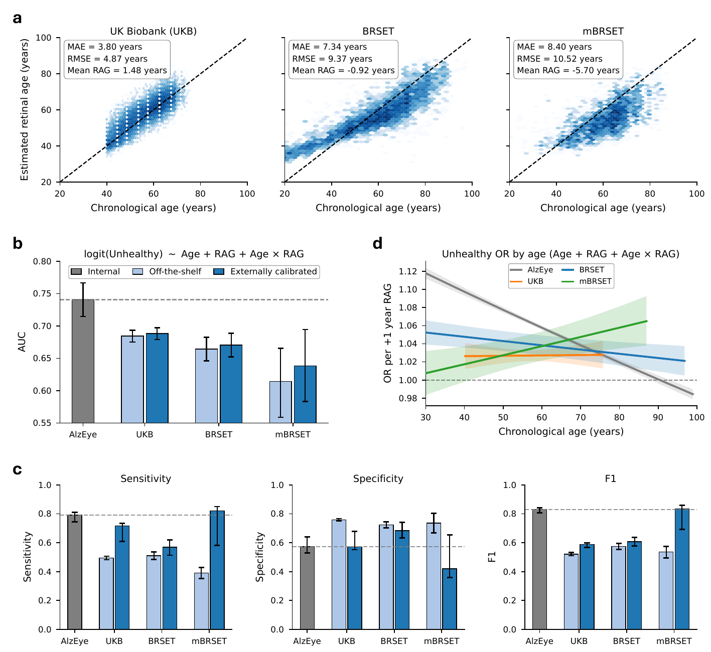

**Fig. 5. Generalisation across external cohorts: UK Biobank, BRSET and mBRSET.**
Each external cohort is split 50/50 at the patient level, stratified by Unhealthy; evaluations are reported on the local test split.
**a.** External retinal age model performance. Hexbin density of estimated retinal age vs chronological age in each external cohort; the dashed line is identity. Per-cohort MAE, RMSE and mean RAG are annotated in each panel.
**b.** External AUC under the Age + RAG + Age × RAG logistic. The model logit(Unhealthy) ∼ Age + RAG + Age × RAG is evaluated on each external cohort. Internal: AlzEye disease-classification subset test split (dashed reference line). Off-the-shelf (light blue): the AlzEye-fit logistic applied without refit. Externally calibrated (dark blue): the same specification refit on the local training split. Error bars: 95 % CI from a patient-level cluster bootstrap.
**c.** Sensitivity, specificity and F1 at the operating threshold for each cohort × regime. Off-the-shelf evaluations use the *fixed AlzEye internal Youden threshold* (0.742, the only honest "no recalibration" definition), held constant across bootstrap resamples. Externally-calibrated evaluations use a per-cohort Youden threshold computed on the local training split. Internal references are shown as dashed lines.
**d.** Implied per-year odds-ratio curves. Curves derived from each cohort's externally-calibrated Age + RAG + Age × RAG logistic for the *Unhealthy* outcome, plotted against chronological age. The AlzEye internal curve (grey) is reproduced for reference. An OR > 1 indicates a positive RAG–disease association at that age.

### Appendix

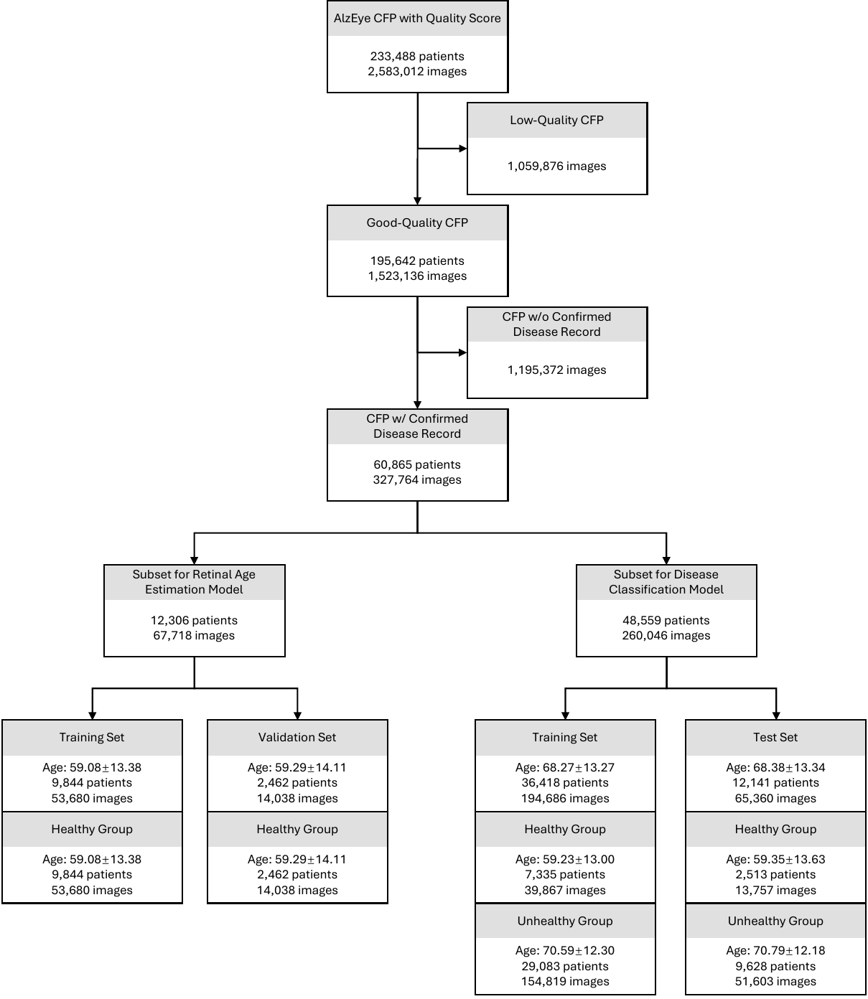

**Supplementary Fig. 1. AlzEye cohort assembly flow.** Filtering pipeline from the raw quality-scored images down to the analytic AlzEye cohort. The cohort is partitioned at the patient level into a *retinal-age estimation subset* (healthy patients only) used to train the retinal age model, and a *disease-classification subset* (healthy and unhealthy patients) used to fit and evaluate the downstream logistic associations. The val split of the disease-classification subset is reserved and excluded from all analyses; it is omitted from the diagram for clarity.

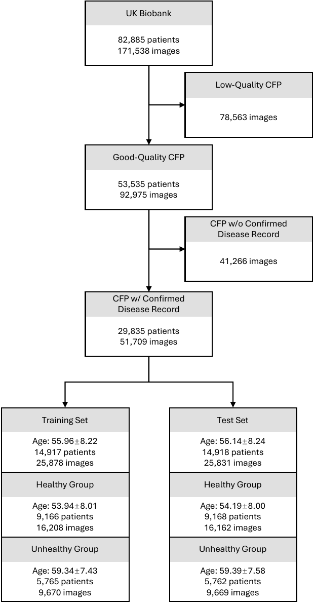

**Supplementary Fig. 2. UK Biobank cohort assembly flow.** Quality- and disease-label filtering pipeline; the analytic UKB cohort is split 50/50 at the patient level, stratified by Unhealthy, into a training split (used for external calibration) and a test split (used for evaluation).

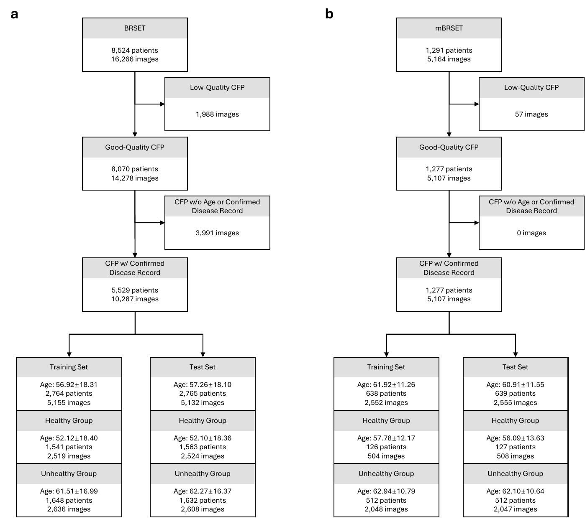

**Supplementary Fig. 3. BRSET and mBRSET cohort assembly flows.** **a.** BRSET filtering pipeline and patient-level 50/50 split, stratified by Unhealthy. **b.** mBRSET filtering pipeline and patient-level 50/50 split, stratified by Unhealthy. mBRSET shows a substantially smaller healthy-patient count per split than the other external cohorts.

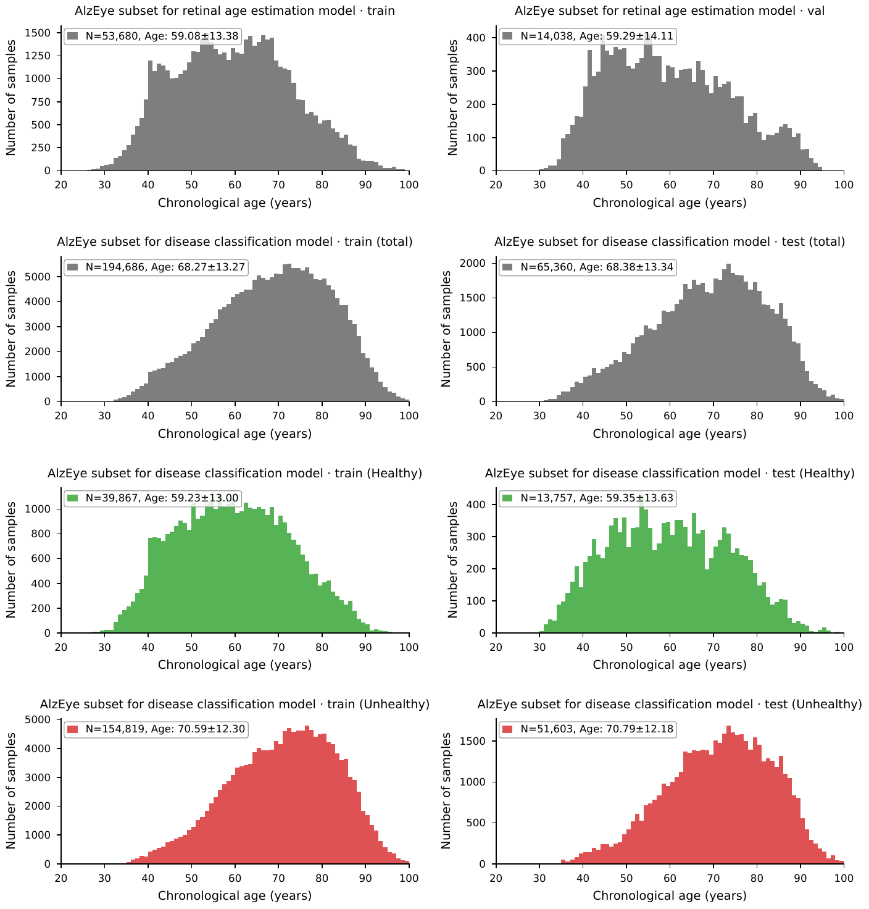

**Supplementary Fig. 4. AlzEye chronological-age distributions per split.** Histograms with 1-year bins; per-panel legends report N and age mean ± s.d. Row 1: retinal-age estimation subset (train and val). Rows 2–4: disease-classification subset (train and test), with each panel showing total (grey), Healthy (green) and Unhealthy (red). Within the disease-classification subset, unhealthy patients are systematically older than healthy patients in both train and test splits.

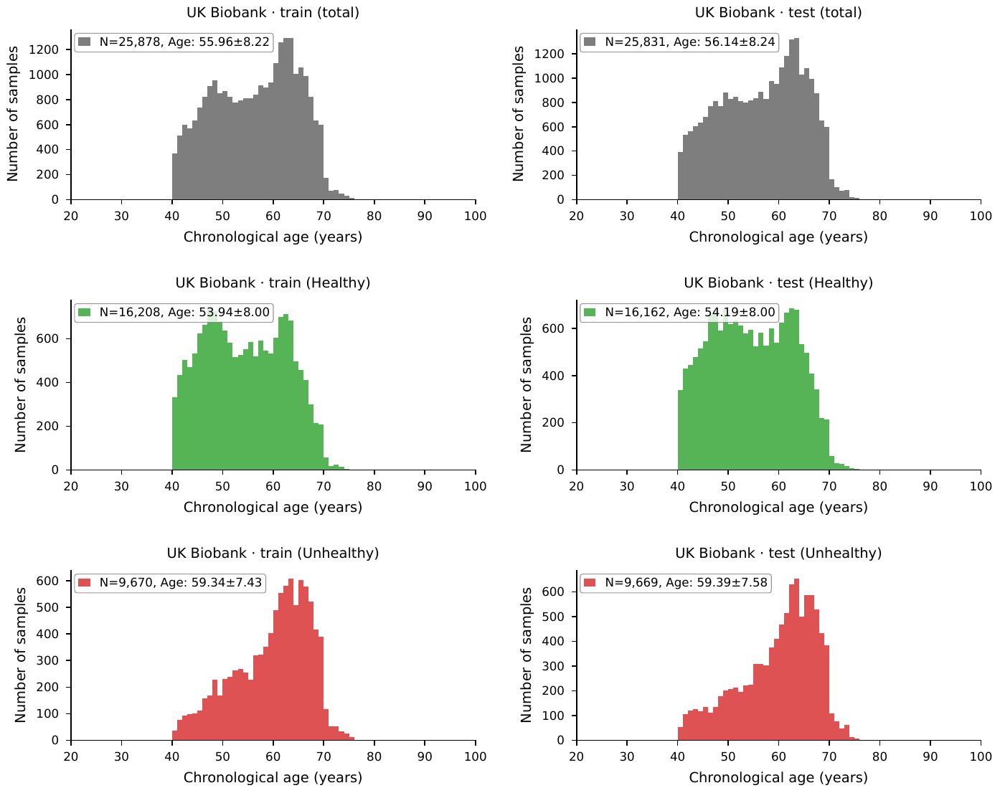

**Supplementary Fig. 5. UK Biobank chronological-age distributions per split.** 3 × 2 layout: train (left column) vs test (right column); total (grey), Healthy (green) and Unhealthy (red) by row. 1-year bins; per-panel legends report N and age mean ± s.d. UKB exhibits a narrow age range by recruitment design (40–69 at baseline).

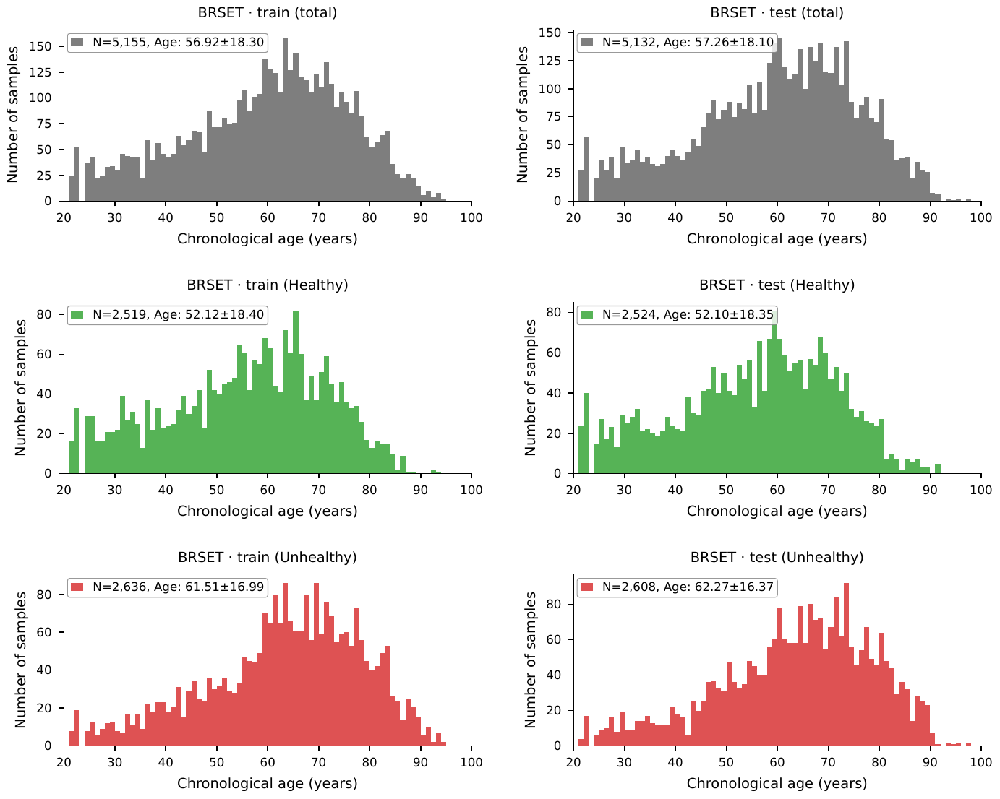

**Supplementary Fig. 6. BRSET chronological-age distributions per split.** Same layout as Supplementary Fig. 5. BRSET has the widest age spread of any external cohort, including paediatric and elderly patients.

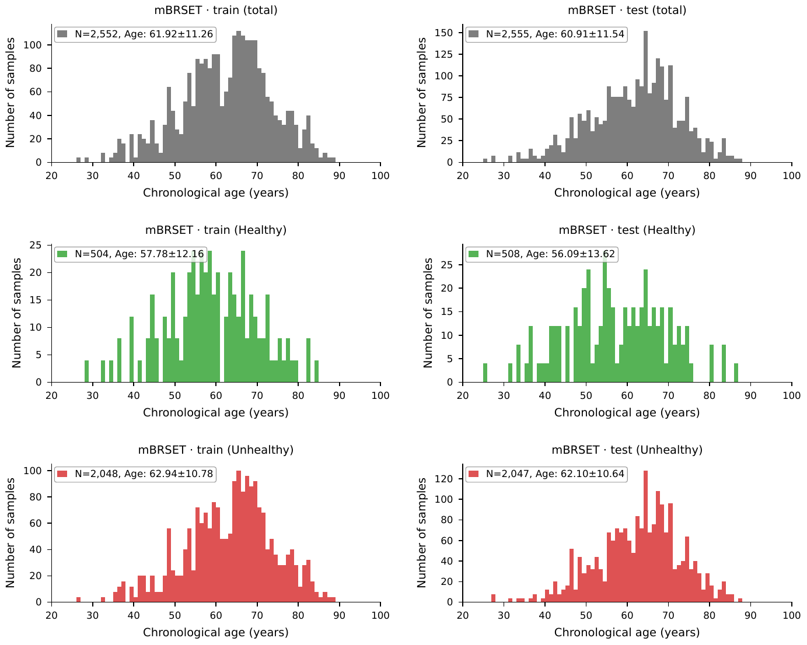

**Supplementary Fig. 7. mBRSET chronological-age distributions per split.** Same layout as Supplementary Fig. 5. The small per-split healthy-patient count is notable.

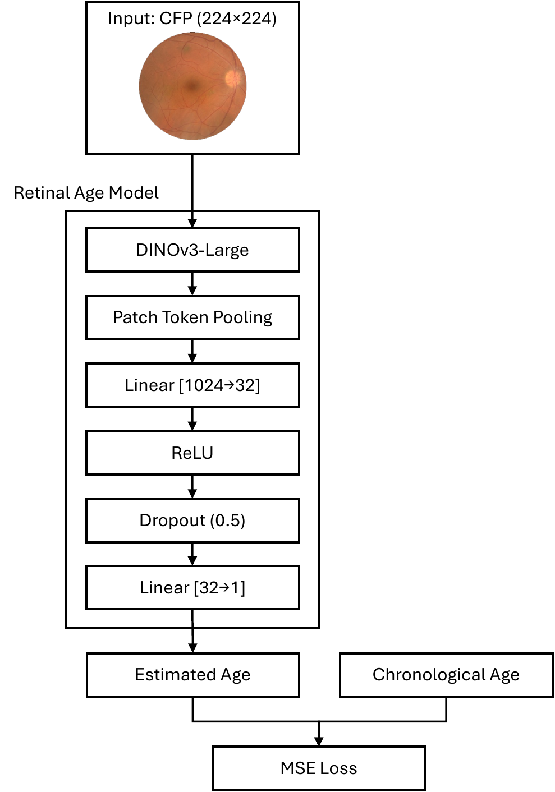

**Supplementary Fig. 8. Retinal age model architecture.** A colour fundus photograph (resized to 224 × 224) is encoded by a DINOv3-Large vision transformer backbone. Patch tokens (excluding the prefix / class token) are mean-pooled and layer-normalised, then passed through a two-layer regression head (Linear [1024 → 32] → ReLU → Dropout (0.5) → Linear [32 → 1]) to produce the estimated retinal age. The backbone is fine-tuned end-to-end against the chronological age target under a mean-squared-error (MSE) loss.
